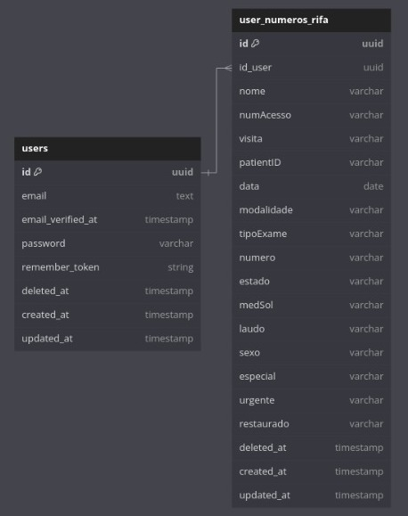

# MediLabProject
Projeto de teste do Wesley Sieiro Takatsu de Araujo  


## Projeto rodando em testes:
[Teste o projeto rodando](http://62.169.26.126/)

## Tecnologias utilizadas:  
PHP, HTML, CSS, Javascript, Postgres  
Laravel, Docker, Docker-compose, Bootstrap, Jquery  
ORM Eloquent, Migrations, UUID, Middlewares  
Sanctum para autenticação via token no HEADER  
Padrão MVC, com model Person ligado ao User por chave estrangeira.  
Blade, JQuery, Datatables, Ajax
Foram criadas rotas Web e de APi  

__Sessões são utilizadas para manter o login do usuário via Web.__  
__Via API usa o token em todas as requisições.__  
  
O banco de dados é persistido em ./sail-pgsql e precisam de permissão para alteração.  

  

Na migration os dados JSON são carregados no banco.  
Os usuários carregam seu nome em minúsculo, sem espaços, seguidos de @teste.com.  
Ex: Anonimo 1 -> anonimo1@teste.com  
  
A senha é 12345 em todos.  
A senha é em HASH.  
Os IDs de user e de person são do tipo UUID.  
  
### Rodar as migrations
```
sail artisan migrate
```




## Instalação do ambiente de desenvolvimento
### Instalação de algumas dependências
```
sudo apt-get install \
    apt-transport-https \
    ca-certificates \
    curl \
    gnupg \
    lsb-release
```
  

### 
### Instalação do Docker
Para instalação no linux mint segue a url:
https://linuxiac.com/how-to-install-docker-on-linux-mint-21/

```
curl -fsSL https://download.docker.com/linux/ubuntu/gpg | sudo gpg --dearmor -o /usr/share/keyrings/docker-archive-keyring.gpg
```

```
echo "deb [arch=amd64 signed-by=/usr/share/keyrings/docker-archive-keyring.gpg] https://download.docker.com/linux/ubuntu \
$(lsb_release -cs) stable" | sudo tee /etc/apt/sources.list.d/docker.list > /dev/null
```

```
sudo apt-get update
```

```
sudo apt-get install docker-ce docker-ce-cli containerd.io
```

Depois de instalado e configurado rode o Docker:
```
sudo service docker start
```

Testar se o serviço Docker está rodando corretamente:
```
sudo docker run hello-world  
```


##
### Docker-Compose - Instalação e configuração:
OBS: EM ALGUNS CASOS PODE ESTAR NO /usr/bin/docker-compose
```
sudo curl -L "https://github.com/docker/compose/releases/download/1.29.2/docker-compose-$(uname -s)-$(uname -m)" -o /usr/local/bin/docker-compose
```

```
sudo chmod +x /usr/local/bin/docker-compose
```

```
docker-compose --version  
```
  
##
### Para usar o Docker sem usar sudo
https://docs.docker.com/engine/install/linux-postinstall/
  
##  
### Configurar para o fuso horário de São Paulo
```
sudo timedatectl set-timezone America/Sao_Paulo
```
  
##
### Adicionar o repositório do PHP:
```
sudo add-apt-repository ppa:ondrej/php
```

##
### Instalar os pacotes do PHP instalado. Verificar com php version.
```
sudo apt-get install -y php8.3-cli php8.3-common php8.3-pgsql php8.3-zip php8.3-gd php8.3-mbstring php8.3-curl php8.3-xml php8.3-bcmath
```
##
### Install Composer
```
curl -sS https://getcomposer.org/installer | php -- --install-dir=/usr/bin --filename=composer
```

```
php -r "copy('https://getcomposer.org/installer', 'composer-setup.php');"
php -r "if (hash_file('sha384', 'composer-setup.php') === 'e21205b207c3ff031906575712edab6f13eb0b361f2085f1f1237b7126d785e826a450292b6cfd1d64d92e6563bbde02') { echo 'Installer verified'; } else { echo 'Installer corrupt'; unlink('composer-setup.php'); } echo PHP_EOL;"
php composer-setup.php
php -r "unlink('composer-setup.php');"
```

```
sudo apt-get install composer
```

## Após instalar as dependências:
No diretório do projeto baixe todos os pacotes:  
```
composer install
```

### Executar o Sail diretamente
Abra o arquivo de configuração do seu shell.
```
nano ~/.bashrc
```

No arquivo de configuração do shell, adicione o seguinte alias no final do arquivo:
```
alias sail='bash vendor/bin/sail'
```

Salve e saia do editor de texto. No Nano, você pode salvar pressionando Ctrl + O, pressionar Enter e, em seguida, sair pressionando Ctrl + X.

Atualize a configuração do shell para que as alterações tenham efeito imediatamente. 
```
source ~/.bashrc
```

Agora, você deve ser capaz de usar o comando sail diretamente no terminal Linux sem precisar digitar ./vendor/bin/sail.
Por exemplo, você pode usar sail up em vez de ./vendor/bin/sail up.

Lembre-se de que qualquer alteração feita no arquivo de configuração do shell só terá efeito na sessão atual e nas futuras sessões do terminal após a atualização da configuração do shell.  


  


  
  
## Rotas de API:  
Corpo em JSON  
O token de autenticação pelo HEADER  

User:  
List: GET http://127.0.0.1/api/users  
Por ID: GET http://127.0.0.1/api/users/[ID]  
Store: POST http://127.0.0.1/api/users {"email", "password"}  
Update: PUT http://127.0.0.1/api/users/[ID]  
Delete: DEL http://127.0.0.1/api/users/[ID]  
  
Person:  
List: GET http://127.0.0.1/api/people  
Store Person: POST http://127.0.0.1/api/people {"id", "nome", "numAcesso", "visita", "patientID", "data", "modalidade", "tipoExame", "numero", "estado", "medSol", "laudo", "sexo", "especial", "urgente", "restaurado"}  
  
Store Person + User: POST {todas as informações de user e person}  


Autenticação:  
Login: POST http://127.0.0.1/api/login {"email", "password", "device_name"}  
Teste Login: POST http://127.0.0.1/api/isloged -> HEADER: {Authorization: Bearer [token]}  